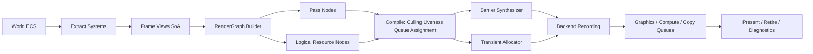
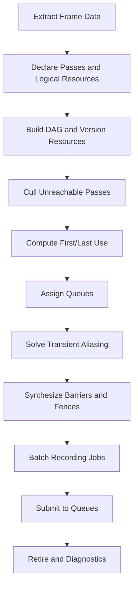

# RenderGraph 深度研究与重构报告

## 执行摘要

本报告基于仓库 `chenhuawang-04/Render` 的现有文档与核心代码，结合官方图形 API 文档与主流开源实现，对适用于现代 Vulkan / D3D12 / Metal 级 GPU 的 RenderGraph 架构进行了重构级分析。用户提到的 `docs/architecture_manual.m` 在仓库中实际对应为 `docs/architecture_manual.md`；该文档表明项目当前是一个以 Vulkan 1.3、Windows/SDL3 为主、带有 Runtime 服务层、Scene Recorder、RenderTarget 系统、ECS 全 POD 组件、以及帧协调器的多层渲染架构。`RuntimeExecution` 已经具备 BeginFrame / Prepare / FlushUploads / PreRecord / Record / Submit / Present / Retire / Diagnostics 这类阶段化生命周期，但从仓库文档与代码职责分布看，当前更像“手工编排的阶段式渲染运行时 + 渲染目标池”，还不是统一的“逻辑资源 SSA + Pass DAG 编译器”式 RenderGraph。fileciteturn29file0L3-L3 fileciteturn30file0L3-L3

结论很明确：**最合适的方向不是在现有 `SceneRecorder3D`、`RenderTargetPool`、`FrameScheduler` 之上继续堆叠更多手写规则，而是引入一个“以逻辑资源和访问声明为中心”的 RenderGraph 编译层**。这一层应吸收 Filament 的图编译思路——先构建 DAG、裁剪不可达节点、在首用/末用点做资源实化与回收——并吸收 Unity RenderGraph 的显式访问声明、瞬态资源、异步计算、Pass 裁剪与调试可视化经验，再把 Vulkan Synchronization2、D3D12 Resource Barrier / Alias Barrier / 多队列 Fence 作为后端映射对象。Filament 的 `compile()` 明确做了 unreachable node culling、资源 first/last user 计算，以及 devirtualize / destroy 生命周期挂接；Unity 的官方实现则把 `UseTexture`、`SetRenderAttachment`、`CreateTransientTexture`、`EnableAsyncCompute`、`AllowPassCulling` 等作为一等 API 暴露出来。fileciteturn35file0L3-L3 fileciteturn39file0L3-L3

结合当前仓库的 ECS 方向，我的推荐设计是：**保留现有 ECS “纯数据组件 + 静态系统 + 少/无虚函数”的原则，把 RenderGraph 放在 ECS 抽取层之后，而不是让图执行器直接遍历世界对象**。换言之，ECS 负责产生 cache-friendly 的 Frame Views / Render Packets，RenderGraph 只消费稳定、只读、按视图/材质/频率组织的 SoA 帧数据；这样能同时满足数据导向、低全局状态、任务并行、可调试性与跨 API 可移植性。仓库自己的架构手册已经把 ECS 定义为“全 POD 组件设计”，这与推荐方案是高度一致的。fileciteturn29file0L3-L3

在优先级上，我建议把需求排序定为：**性能与可扩展性优先，确定性与可调试性并列第二，可移植性第三，显存峰值控制第四**。原因是当前仓库已拥有相当多的模块化子系统，如果缺少统一图编译层，未来随着 2D/3D、阴影、IBL、粒子、后处理、异步上传、反射/自定义视图继续增长，CPU 录制成本、Barrier 复杂度、RT 生命周期、队列协调与调试成本都会呈非线性恶化；而 RenderGraph 的价值恰恰体现在把这些复杂性前移到编译阶段。D3D12 与 Vulkan 的官方设计都把资源状态管理和同步责任交给应用；如果没有图编译器，应用层复杂度会持续外泄。fileciteturn59file0L3-L3 fileciteturn48file0L3-L3

## 仓库现状与诊断

`VulkanRender_New` 当前的分层结构已经非常接近“适合引入 RenderGraph 的前状态”：上层有 `Render Runtime Host`、`Frame Coordinators`、`Scene Submission Layer`，中间有 `RenderTargetHost / RenderTargetPool / SceneRenderTargetSet / Bloom / Composite`，底层有资源宿主与平台层；同时 Runtime 还试图把 Host/Renderer 抽象为 `RuntimeService`，并通过 `ServiceDependencyGraph` 与 `Runtime<Profile>` 做编译期裁剪。也就是说，仓库已经具备了“服务图”“场景录制器”“离屏目标池”“帧阶段”“ECS 数据”这些 RenderGraph 的必要素材，只是它们尚未被统一到一个逻辑资源图编译器里。fileciteturn29file0L3-L3

从 `RuntimeExecution` 的代码可以看到，当前每帧执行阶段被硬编码为 `BeginFrame → ServiceBeginFrame → Prepare → FlushUploads → PreRecord → Record → Submit → Present → EndFrame → Retire → Diagnostics`。这说明系统已经把“帧生命周期”切分出来，但阶段之间的资源依赖、跨队列同步、别名机会、Pass 合并机会并不是图编译产物，而更像靠模块接口与调用顺序维持。这样的设计在项目早期可控，但一旦 Pass 数量、资源版本数与视图数量增长，就很容易出现“生命周期定义在 A，Barrier 写在 B，资源释放依赖 C，调试观察点在 D”的分布式复杂度。fileciteturn30file0L3-L3

仓库的 `RenderView` 设计说明其渲染视图模型已经较成熟： view kind、lighting/shadow/postprocess/overlay flags、viewport/scissor、目标引用、背景覆盖、camera/camera_transform、签名等都已被封装。不过 `RenderView` 的签名组合使用了指针地址与 revision，这对帧内缓存失效是高效的，但意味着它天然不是“跨进程/跨运行的强确定性键”；因此如果未来希望 RenderGraph 编译缓存具备更强的复现性，建议把缓存关键字从“地址参与的运行时签名”改为“view descriptor + resource descriptor + pipeline key + extracted revision”的纯值语义键。这里不是说当前实现错误，而是说**图编译缓存**与**帧内脏标记**不应复用同一键空间。fileciteturn31file0L3-L3

仓库的架构手册已经把 `RenderTargetPool` 定义为尺寸分组对象池，并支持与 `FrameRetire` 联动的延迟回收；这说明项目已经意识到“重建目标很贵、跨帧生命周期需要退休机制”。但**对象池复用不等价于 RenderGraph 语义上的 transient aliasing**：前者只是“同描述资源可重用”，后者则是“不同逻辑资源在不重叠生命周期上可共享同一物理内存页”。Filament 在编译后依据 first/last use 把资源挂到 devirtualize/destroy 列表，正体现了这种图级生命周期推导；D3D12 也明确要求对同一堆上重叠映射的 placed/reserved resources 使用 aliasing barrier。对当前仓库而言，这正是现有池化系统与未来 RenderGraph 编译器之间最关键的能力鸿沟。fileciteturn29file0L3-L3 fileciteturn35file0L3-L3 fileciteturn59file0L3-L3

仓库文档还透露出一个非常重要的现实约束：5 月 5 日的后续代码审查文档把 Runtime/Profile 模板栈、编译收敛与若干子系统整理列为持续整改项。这说明**仓库当前最适合的是“引入一层稳定、窄接口、可渐进替换的 RenderGraph 编译器”，而不是一次性推翻全部运行时模板体系**。换句话说，RenderGraph 需要成为架构“收束复杂度”的工具，而不是再引入一套新的宏模板宇宙。fileciteturn28file0L3-L3

## 目标、非目标与优先级需求

在目标平台与语言没有被明确指定的前提下，本报告采用如下假设：**目标 GPU 为支持 Vulkan / D3D12 / Metal 级别显式资源管理与多队列能力的现代硬件；语言/运行时保持架构无关，并给出 C++17 与伪代码示例**。这个假设与仓库当前 Vulkan 1.3 定位兼容，也能为未来跨 API 扩展留出接口面。fileciteturn29file0L3-L3

推荐目标可以概括为五类。第一是**性能**：减少 CPU 端显式 Barrier / RenderTarget / Descriptor 编排成本，自动裁剪不可达 Pass，降低多视图/多后处理/多队列场景下的录制开销。第二是**可扩展性**：允许新增 Pass 主要通过“声明读写”完成，而不是在多个 Host/Coordinator 中穿插生命周期代码。第三是**确定性与可调试性**：图构建、拓扑、Barrier 推导、资源峰值与队列同步都必须可观察、可导出、可回放。第四是**可移植性**：前端保持统一语义，后端把资源状态/同步映射为 Vulkan Sync2 与 D3D12 Barrier/Fence；Metal 路径则通过更保守的后端映射维持语义一致。第五是**显存使用**：用 transient allocator + aliasing 编译降低峰值内存，而不是仅依赖池化复用。Unity RenderGraph 已把访问标记、瞬态资源与异步计算纳入官方 API；Khronos 与 Microsoft 的官方文档则都强调资源状态与同步责任在应用侧，这些都支撑上述目标集。fileciteturn39file0L3-L3 fileciteturn48file0L3-L3 fileciteturn59file0L3-L3

非目标也需要明确。第一，**不追求把 ECS 世界直接变成执行图**；RenderGraph 不应该直接以 Entity 为最小执行单元，否则图规模、脏标记与调试复杂度都会失控。第二，**不追求第一阶段就支持全自动多 GPU 负载切分**；单 GPU 正确性、Async Compute、Copy Queue、Transient Aliasing 先成熟再扩展。第三，**不追求第一阶段做激进的本机 RenderPass/Subpass 合并魔法**；先把图语义与同步正确，再在 Vulkan dynamic rendering local read / tile-friendly path 上做增量优化。第四，**不把 RenderGraph 变成业务逻辑脚本系统**；它解决的是资源与执行编排，而不是场景逻辑。Khronos 的 TBR 最佳实践表明，“保持数据在片上、合理 load/store、用 transient/lazy allocation、避免过宽 barrier”这类收益建立在正确语义之上，而不是魔法启发式之上。fileciteturn52file0L3-L3

下面是建议的优先级排序。

| 优先级 | 需求 | 说明 | 依据 |
|---|---|---|---|
| P0 | 正确性与同步语义 | 资源状态、跨队列 Fence、UAV/Alias/Transition、导入资源副作用语义必须先统一 | fileciteturn48file0L3-L3 fileciteturn59file0L3-L3 fileciteturn61file0L3-L3 |
| P0 | 图编译与资源生命周期 | 不可达 Pass 裁剪、first/last use、瞬态资源回收、导入/导出语义 | fileciteturn35file0L3-L3 fileciteturn38file0L3-L3 |
| P1 | ECS 抽取与并行记录 | ECS 只产出 frame data，图构建和命令录制支持 job/task 并行 | fileciteturn29file0L3-L3 fileciteturn42file0L3-L3 |
| P1 | 描述符与绑定模型 | 支持 persistent cache + per-frame transient staging，兼容 bindless 演进 | fileciteturn39file0L3-L3 fileciteturn60file0L3-L3 |
| P2 | Async Compute / Copy Queue | 在图中显式标注队列类，基于 Fence 生成跨队列依赖 | fileciteturn39file0L3-L3 fileciteturn61file0L3-L3 |
| P2 | TBR / Native Pass 优化 | 动态渲染、本地读取、适当 load/store 与 transient lazily-allocated attachments | fileciteturn51file0L3-L3 fileciteturn52file0L3-L3 |
| P3 | 多 GPU / 设备组 | 单 GPU 算法稳定后再扩充设备组和资源镜像/分片策略 | fileciteturn51file0L3-L3 |

## 方案对比与推荐路线

先看“架构类型”而不是具体 API。对当前仓库，真正需要选择的是：继续维持命令式编排，还是引入图编译；如果引入图编译，又是偏“本机 RenderPass 优先”还是偏“逻辑资源 SSA 优先”。

| 方案 | 核心思路 | 优点 | 代价 | 与当前仓库适配度 |
|---|---|---|---|---|
| 继续命令式编排 | `SceneRecorder`/`Host` 手写顺序、Barrier、RT 生命周期 | 改动最小 | 复杂度继续外泄；难做 aliasing / 自动裁剪 / 多队列分析 | 低，属于延后问题 |
| RenderPass 优先图 | 先围绕 Vulkan subpass/native pass 建图 | TBR 场景可能很强 | 容易把前端绑死在 Vulkan/移动优化语义上 | 中等，不利跨 API |
| 逻辑资源 SSA RenderGraph | Pass 声明读写，编译阶段做裁剪/生命周期/Barrier/队列分配 | 可移植、可调试、适合大规模演进 | 需要建立完整资源语义模型 | **最高，推荐** |
| ECS 全图执行化 | 让 Entity/Component 直接驱动图节点 | 理论统一 | 图过大、调试困难、缓存键复杂、业务和渲染耦合 | 低，不建议 |

推荐路线是第三种：**逻辑资源 SSA RenderGraph，后端再做 native render pass / local read / tile 优化特化**。这个路线与 Filament 的资源图编译方式、Unity 的声明式 Pass Builder、D3D12/Vulkan 的显式同步责任最一致。Filament 明确通过 `compile()` 对图做裁剪、版本化与资源实化/销毁挂接；Unity 则把 `CreateTransientTexture`、`AllowPassCulling`、`EnableAsyncCompute` 公开为 API；Khronos 又强调 dynamic rendering 与 dynamic_rendering_local_read 是“硬件层实现一致、代码层更简化”的现代路径。fileciteturn35file0L3-L3 fileciteturn39file0L3-L3 fileciteturn51file0L3-L3

再看业界实现的“可借鉴点”。

| 实现 | 能直接借鉴的重点 | 不应照搬的地方 | 主要证据 |
|---|---|---|---|
| 当前仓库 | ECS 全 POD、Runtime 分阶段、视图模型、离屏目标池、上传/描述符/管线宿主分层 | 依赖人工编排，图语义尚未统一；缓存键部分混入指针地址 | fileciteturn29file0L3-L3 fileciteturn30file0L3-L3 fileciteturn31file0L3-L3 |
| Filament | DAG 编译、不可达节点裁剪、资源版本化、first/last use、GraphViz 导出 | API 相对内聚于其 engine backend，不必照搬类层次 | fileciteturn35file0L3-L3 |
| Unity RenderGraph | 显式访问标记、瞬态纹理/Buffer、Async Compute、Pass Culling、Native Pass 合并与 Viewer | C# / SRP 生态特定对象模型不适合原样移植到 C++ ECS 引擎 | fileciteturn38file0L3-L3 fileciteturn39file0L3-L3 |
| bgfx | “View 作为 pass 桶”、多线程 Encoder 提交、瞬态 VB/IB 思路 | 不是完整资源生命周期图，更多是 submission framework | fileciteturn42file0L3-L3 |
| Vulkan / D3D12 官方文档 | 明确同步责任在应用；支持多队列、动态渲染、descriptor indexing、timeline/fence、alias barrier | 不能把后端 API 细节直接暴露给业务层 | fileciteturn48file0L3-L3 fileciteturn51file0L3-L3 fileciteturn59file0L3-L3 fileciteturn61file0L3-L3 |

从更广义的研究视角看，Piko 这类可编程图形流水线工作强调把“阶段描述、空间组织与调度策略”解耦，这与本报告建议的“把 ECS 抽取、Pass 语义描述、任务调度、后端 Barrier 映射拆成四层”是同方向的。它不是 RenderGraph 本身，但对“调度不要直接写死在业务 Pass 里”这一原则很有启发。citeturn24academia3

## 推荐架构设计

### 总体蓝图

推荐的新架构应在现有系统之上新增一层 **FrameGraph Compiler**，并把原本分散在 `SceneRecorder3D`、`RenderTargetPool`、部分 Host/Coordinator 中的生命周期与同步规则收束到这一层。逻辑上应分成四个层次：**ECS 抽取层、图声明层、图编译层、后端记录/提交层**。这四层分别处理“拿什么数据”“声明要做什么”“推导怎么做”“映射到 API 怎么提交”。这样可以最大限度保持 ECS 与后端解耦。这个切分也与当前仓库已有的 Runtime 分阶段思想兼容。fileciteturn29file0L3-L3 fileciteturn30file0L3-L3



### 数据模型

核心数据模型建议采用**资源 SSA 化**。每个逻辑资源都由 descriptor 描述，不直接携带物理句柄；每次“写”都会形成一个新的资源版本；Pass 只声明自己读哪个版本、写出哪个版本。这样才能正确做 first/last use、版本间依赖、只读共享与写后读同步。Filament 的 FrameGraph 实现已经证明，这种做法便于在 `compile()` 阶段统一处理不可达节点裁剪、资源版本管理与 devirtualize/destroy 生命周期。fileciteturn35file0L3-L3

建议的核心类型如下。

```cpp
enum class QueueClass : uint8_t { Graphics, Compute, Copy };
enum class AccessType : uint8_t { Read, Write, ReadWrite };
enum class ResourceKind : uint8_t { Texture, Buffer };
enum class LifetimeClass : uint8_t { Imported, Persistent, Transient };

struct TextureDesc {
    uint32_t width = 0, height = 0, depth = 1;
    uint16_t layers = 1, mips = 1;
    Format format = Format::Unknown;
    SampleCount samples = SampleCount::x1;
    UsageFlags usage = {};
    LifetimeClass lifetime = LifetimeClass::Transient;
    bool allow_alias = true;
    bool clear_on_first_use = false;
};

struct BufferDesc {
    uint64_t size = 0;
    BufferUsage usage = {};
    LifetimeClass lifetime = LifetimeClass::Transient;
    bool allow_alias = true;
};

struct ResourceHandle {
    uint32_t id = 0;
    uint16_t version = 0;
};

struct PassHandle { uint32_t id = 0; };

struct PassFlags {
    bool side_effect = false;         // 导入目标写入 / 读回 / 查询 / Present 等
    bool allow_cull = true;           // 是否允许图裁剪
    bool allow_reorder = true;        // 是否允许重排
    bool async_compute = false;
};

struct AccessEdge {
    ResourceHandle resource;
    AccessType access;
    PipelineScope scope;
    SubresourceRange subrange;
};

struct PassDesc {
    std::string name;
    QueueClass preferred_queue = QueueClass::Graphics;
    PassFlags flags{};
    std::vector<AccessEdge> reads;
    std::vector<AccessEdge> writes;
};
```

这里要强调一点：**RenderGraph 的资源句柄不是 GPU 资源句柄**。前者属于图编译期逻辑 ID，后者属于执行期物理分配结果。把二者分离，才能安全地做 aliasing、导入/导出与调试可视化。Unity 在 Builder API 里把 `TextureHandle / BufferHandle` 定义成图上下文句柄，并单独提供 `ImportTexture`、`CreateTransientTexture` 等操作，也是在强化这件事。fileciteturn38file0L3-L3 fileciteturn39file0L3-L3

### ECS 集成模式

RenderGraph 与 ECS 的正确接缝，不是“让 RenderGraph 直接遍历组件”，而是“由 ECS 系统先做抽取”。仓库架构手册已经把 ECS 定义为纯数据组件、静态方法系统、全 POD，这对渲染抽取极其有利：可以在 `Prepare` 或 `PreRecord` 阶段，把可见对象、光源、阴影投射体、材质参数、实例数据、粒子发射器等整理成 **Frame Views / Render Packets**，并按视图、材质、PSO Key、频率分组为 SoA 连续内存。这样做比直接在 Pass 中访问 ECS 世界更 cache-friendly，也更利于 job 并行。fileciteturn29file0L3-L3

推荐的集成模式如下：

```cpp
struct ExtractedView {
    ViewId id;
    CameraGpu camera;
    Span<MeshDraw> opaque_draws;
    Span<MeshDraw> transparent_draws;
    Span<LightGpu> lights;
    Span<ShadowCasterGpu> shadow_casters;
    Span<ParticleBatchGpu> particle_batches;
};

struct FrameExtraction {
    uint64_t frame_index;
    Span<ExtractedView> views;
    Span<UploadRequest> uploads;
    Span<GlobalSceneParams> globals;
};
```

ECS 系统负责更新组件 revision、做裁剪、排序、批次构建与 GPU 参数打包；RenderGraph 只接收 `FrameExtraction`，并按照视图和效果链搭建资源图。这种模式有三个好处。第一，全局状态最小化，因为图构建只读 frame snapshot。第二，任务并行容易，因为不同抽取系统可以独立产生 SoA。第三，确定性更强，因为图输入不再依赖临时指针遍历顺序。仓库当前 `RenderView` 签名把指针地址混入 key，这对于局部缓存是可行的；但如果改为抽取快照，图编译缓存可以只依赖值对象和 revision。fileciteturn31file0L3-L3

### 图构建、裁剪与调度

图构建推荐分成两步：先**声明式建图**，后**编译式求解**。声明阶段只收集 Pass、资源、读写关系、导入导出与副作用；编译阶段才执行拓扑排序、不可达裁剪、first/last use 计算、队列分配、Barrier 插入、别名求解与提交批次切分。Filament 的 `compile()` 就是这一方向：先 cull unreachable nodes，再为资源计算 first/last active pass，首用点 devirtualize、末用点 destroy，并且支持导出 GraphViz 数据。fileciteturn35file0L3-L3

推荐编译流程：



现有 `RuntimeExecution` 已经把 Prepare / Record / Submit / Retire 分开，因此最自然的方式是在 `Prepare` 末尾或 `PreRecord` 开始处执行图编译，然后把编译结果交给并行录制作业。也就是说，不必推翻现有 Runtime 阶段，只需把“Record 之前的若干人工准备”升级成“图编译”。fileciteturn30file0L3-L3

一个值得借鉴的细节，是 **Pass culling 的副作用语义**。导入资源写入、Present、读回、查询、统计、外部信号等，都必须标记 side effect，不能被自动裁剪。Filament 在 `addPresentPass()` 中明确将其作为 target side-effect 处理；Unity 在 `AllowPassCulling(false)` 以及 imported texture 写入语义上同样强调这一点。当前仓库若要平滑迁移，可先把 Swapchain Backbuffer、Readback、GPU Query、调试叠加层等全部视为 side-effect rooted pass。fileciteturn35file0L3-L3 fileciteturn38file0L3-L3 fileciteturn39file0L3-L3

### 资源生命周期、别名与分配器

资源生命周期设计必须区分四类对象：**Imported**、**Persistent**、**Transient**、**External-Alias-Prohibited**。Imported 指来自 swapchain、外部贴图、外部 buffer 的资源；Persistent 指跨帧缓存和历史资源；Transient 指只在当前图内生存、允许 aliasing 的资源；External-Alias-Prohibited 指例如某些读回、共享句柄、特殊 API 限制资源，不参与别名。

别名求解推荐采用“**兼容类 + 生命周期区间着色**”而不是简单哈希池。两个资源只有在以下条件都成立时才能 alias：描述符兼容；队列使用不并发；子资源重叠不冲突；其中至少一个不是 imported；没有显式 `no_alias`；其最后读/写与另一个的首次读/写间可插入或天然已有 alias barrier/fence。D3D12 的官方文档明确要求对同一 heap 上重叠映射的不同资源使用 aliasing barrier；Vulkan 的实践则通常通过图级 first/last use + transient attachment/lazy allocation + 合理 barrier 组合实现同类效果。fileciteturn59file0L3-L3 fileciteturn52file0L3-L3

我建议把分配器拆成三个层次：

| 分配器 | 场景 | 推荐算法 | 备注 |
|---|---|---|---|
| Upload / Readback | CPU-GPU 流式数据 | Ring / Linear allocator | 与 Copy Queue / frame fence 串联 |
| Persistent default memory | 常驻纹理、网格、历史缓冲 | Buddy / TLSF / page allocator | 便于碎片控制 |
| Transient graph memory | 当前帧中间 RT / Buffer | Page-based alias arena | 由图编译器分配，不暴露给业务 |

Vulkan 官方最佳实践强调 transient attachment 与 lazily allocated memory 对 tile-based 架构尤其重要；若后端为移动或 tile GPU，应优先把深度、中间 GBuffer、MSAA 中间目标、局部光照缓存纳入 transient/lazy 策略。对于桌面 D3D12，则 placed resources + aliasing barrier 是更现实的映射路线。fileciteturn52file0L3-L3 fileciteturn59file0L3-L3

### 同步、队列与后端映射

同步层建议采用 **backend-neutral scope**：Pass 声明自己对资源的访问类型和管线范围，再由后端根据队列与 API 映射成具体 Barrier / Fence 命令。前端不要出现 `VkImageLayout`、`D3D12_RESOURCE_STATE_*` 这类类型；前端只出现 `ColorAttachmentWrite`、`ShaderSampleRead`、`StorageWrite`、`CopyDst`、`Present`、`DepthReadWrite` 这样的语义范围。

Vulkan 路径建议直接以 Synchronization2 为基线。Khronos 文档明确指出，`VK_KHR_synchronization2` 把 pipeline stage 和 access flag 放到同一 barrier 结构里，新增 `VkDependencyInfo` 聚合多个 barrier，并用 `vkQueueSubmit2` 统一吸收 timeline semaphore 与 device group 等提交信息；同时它还引入了更统一的 `ATTACHMENT_OPTIMAL` 与 `READ_ONLY_OPTIMAL` 布局语义。对 RenderGraph 实现者来说，这意味着 Barrier 生成器更容易写成“语义转 stage/access/layout”的表驱动代码。fileciteturn48file0L3-L3

D3D12 路径则建议把资源状态转换分成三类：**Transition Barrier**、**UAV Barrier**、**Aliasing Barrier**。Microsoft 文档明确说明应用需自己做 per-resource state 管理；aliasing barrier 用于重叠 heap 映射资源；UAV barrier 只在必要的 UAV 读写顺序上插入；同时 common state promotion/decay 可以在很多场景省掉显式 barrier。对 RenderGraph 而言，最有价值的是：把 `COMMON` promotion/decay 纳入编译器规则，而不是把所有边都机械地显式 barrier 化。fileciteturn59file0L3-L3

多队列模型建议限制为三类：Graphics、Compute、Copy。每个 Pass 只声明“偏好队列”与“是否允许 async compute”；编译器再根据资源依赖和后端能力决定是否真正下放到 Compute / Copy 队列。D3D12 官方文档清楚描述了 3D、Compute、Copy 独立队列可并行执行，并通过 Fence 的 `Signal/Wait` 实现跨队列同步，这正适合作为通用图调度模型。fileciteturn61file0L3-L3

关于多 GPU，我建议第一版只做**接口占位**：资源句柄可携带 `device_mask` 或 `node_mask`，但默认单 GPU。真正的多 GPU 仅在以下两类场景值得做：一是镜像式 AFR/多视图分发；二是设备组共享资源的显式分片。Khronos 在 Vulkan 1.1 起就把 device groups 纳入核心路线，但在当前仓库阶段，这个特性不应压倒单 GPU 的可观测正确性。fileciteturn51file0L3-L3

### 绑定模型、描述符与调试工具

绑定模型建议使用“**稳定资源名 + pass-local binding layout + 后端 descriptor lowering**”。不要在上层直接谈 DescriptorSet / Root Signature / Argument Buffer；上层只声明“本 Pass 需要哪些 sampled/storage/uniform/attachment 资源”，编译器再把它们落到 Vulkan descriptor set、D3D12 descriptor table / root descriptor 等后端结构。Unity 的 Builder API 已证明，把 `UseTexture`、`SetRenderAttachment`、`UseBufferRandomAccess` 纳入声明式接口，可以在前端大幅提升正确性和可验证性。fileciteturn39file0L3-L3

描述符管理推荐采取“双层缓存”。第一层是**persistent descriptor cache**，用于长期不变的 SRV/UAV/Sampler / bindless array entry；第二层是**per-frame transient descriptor staging**，用于当前帧中间资源与临时表拷贝。D3D12 官方文档把 descriptor heap 视为连续描述符集合，并明确区分 shader-visible 与 non-shader-visible heap；这非常适合实现“CPU staging heap → GPU visible heap copy”的经典模型。fileciteturn60file0L3-L3

调试方面，建议把 RenderGraph 视为一个**必须自带 viewer 的系统**，这不是锦上添花，而是必要基础设施。最低配工具链应包括：GraphViz/DOT 导出、每个 Pass 的 name/queue/reads/writes/barriers、资源 first/last use、别名冲突解释、峰值显存统计、Pass cull report、跨队列 fence timeline、GPU timestamp ranges。Filament 已直接支持 framegraph GraphViz 导出与 viewer 数据；Unity RenderGraph 也提供 debug session / viewer 机制。对当前仓库而言，这是非常值得补齐的。fileciteturn35file0L3-L3 fileciteturn38file0L3-L3

```mermaid
gantt
title 单帧 RenderGraph 编译与执行节拍
dateFormat  X
axisFormat %s
section CPU
ECS 抽取            :a1, 0, 1
Pass/资源声明       :a2, 1, 1
图编译与别名求解     :a3, 2, 1
并行命令录制         :a4, 3, 2
section GPU
Copy 上传            :b1, 3, 2
Depth / Shadow       :b2, 5, 2
HiZ / Culling        :b3, 7, 1
GBuffer / Opaque     :b4, 8, 2
Lighting / Compute   :b5, 10, 1
Post / Composite     :b6, 11, 2
Present              :b7, 13, 1
```



## API 草案与代码示例

### C++17 示例 API

下面给出一个更适合当前仓库演进的前端 API。它保留“Host / Stage / Recorder”可渐进接入的空间，但把资源语义前移为显式声明。

```cpp
class RenderGraph final {
public:
    TextureHandle importTexture(std::string_view name, const ImportedTextureDesc& desc);
    BufferHandle  importBuffer (std::string_view name, const ImportedBufferDesc& desc);

    TextureHandle createTexture(std::string_view name, const TextureDesc& desc);
    BufferHandle  createBuffer (std::string_view name, const BufferDesc& desc);

    template<class PassData, class SetupFn, class ExecuteFn>
    PassHandle addRasterPass(std::string_view name, SetupFn&& setup, ExecuteFn&& execute);

    template<class PassData, class SetupFn, class ExecuteFn>
    PassHandle addComputePass(std::string_view name, SetupFn&& setup, ExecuteFn&& execute);

    CompiledFrameGraph compile(const FrameCompileConfig& cfg);
};

struct RasterBuilder {
    TextureHandle read(TextureHandle h, PipelineScope scope = PipelineScope::FragmentSample);
    TextureHandle writeColor(TextureHandle h, uint32_t mrt = 0, WritePolicy policy = WritePolicy::Partial);
    TextureHandle writeDepth(TextureHandle h, DepthPolicy policy = DepthPolicy::ReadWrite);
    BufferHandle  read(BufferHandle h, PipelineScope scope = PipelineScope::VertexOrComputeRead);
    BufferHandle  write(BufferHandle h, PipelineScope scope = PipelineScope::ComputeWrite);

    TextureHandle createTransientTexture(std::string_view name, const TextureDesc& desc);
    BufferHandle  createTransientBuffer (std::string_view name, const BufferDesc& desc);

    void allowPassCulling(bool v);
    void allowGlobalStateModification(bool v);
    void enableAsyncCompute(bool v); // 对 raster 默认 false，若后端允许专用路径可放开
    void markSideEffect();
};
```

这个 API 从 Unity 的 RenderGraph Builder 吸收了三个关键思想：资源访问声明、瞬态资源、Pass 级属性；但实现上建议更接近 C++ 引擎而非托管运行时。fileciteturn39file0L3-L3

### 与当前仓库场景录制器的接入示例

第一阶段无需重写所有渲染器。可以先把现有 `SceneRecorder3D` 的每个阶段包装成 RenderGraph Pass，让内部仍调用现有 Host/Renderer，只是输入输出从手写目标改为图句柄。

```cpp
void BuildScene3DGraph(RenderGraph& rg, const ExtractedView& view, const FrameResources& fr) {
    auto depth = rg.createTexture("view.depth", fr.depthDesc);
    auto scene = rg.createTexture("view.sceneColor", fr.sceneColorDesc);
    auto bloom = rg.createTexture("view.bloom", fr.bloomDesc);

    rg.addRasterPass<DepthPrepassData>("DepthPrepass",
        [&](auto& pass, auto& data) {
            data.view = &view;
            data.depth = pass.writeDepth(depth, DepthPolicy::WriteOnly);
        },
        [&](const auto& data, RasterContext& ctx) {
            RecordDepthPrepass(*data.view, ctx, data.depth);
        });

    rg.addRasterPass<GBufferData>("OpaqueScene",
        [&](auto& pass, auto& data) {
            data.view  = &view;
            data.depth = pass.writeDepth(depth, DepthPolicy::ReadWrite);
            data.color = pass.writeColor(scene, 0, WritePolicy::WriteAll);
        },
        [&](const auto& data, RasterContext& ctx) {
            RecordOpaqueScene(*data.view, ctx, data.color, data.depth);
        });

    rg.addComputePass<BloomData>("Bloom",
        [&](auto& pass, auto& data) {
            data.input = pass.read(scene, PipelineScope::ComputeRead);
            data.out   = pass.write(pass.createTransientTexture("bloom.tmp", fr.bloomDesc),
                                    PipelineScope::ComputeWrite);
            pass.enableAsyncCompute(true);
        },
        [&](const auto& data, ComputeContext& ctx) {
            DispatchBloom(ctx, data.input, data.out);
        });

    rg.addRasterPass<CompositeData>("Composite",
        [&](auto& pass, auto& data) {
            data.scene  = pass.read(scene);
            data.bloom  = pass.read(bloom);
            data.target = pass.writeColor(fr.backbuffer, 0, WritePolicy::WriteAll);
            pass.markSideEffect();
        },
        [&](const auto& data, RasterContext& ctx) {
            RecordComposite(ctx, data.scene, data.bloom, data.target);
        });
}
```

### 编译器伪代码

```text
function Compile(graph):
    topological_sort(graph.passes)
    root_set = all side_effect passes + exported resources
    cull passes/resources not reachable from root_set

    for each logical resource version:
        compute first_use, last_use
        infer queue domain and subresource hazards

    assign passes to graphics/compute/copy queues
    for each queue:
        synthesize intra-queue barriers
    for each inter-queue dependency:
        synthesize fence signal/wait pair

    solve aliasing among transient resources:
        group by compatibility class
        interval-color within each memory class
        emit alias barriers where backend requires

    batch passes into recording jobs
    produce:
        - execution order
        - queue submits
        - barrier lists
        - resource allocation plan
        - debug graph
```

### ECS 任务并行示例

```cpp
JobHandle ExtractFrame(World& world, FrameExtraction& out) {
    auto jView     = Jobs::Run([&] { ExtractViews(world, out.views); });
    auto jVisible  = Jobs::RunAfter(jView, [&] { BuildVisibleDraws(world, out.views); });
    auto jLights   = Jobs::Run([&] { ExtractLights(world, out.views); });
    auto jUploads  = Jobs::Run([&] { CollectUploadRequests(world, out.uploads); });
    return Jobs::Combine(jVisible, jLights, jUploads);
}
```

这个模式与 bgfx 的 Encoder 多线程提交思想相容，但比单纯 Encoder 更进一步：**先并行提取/编译，再并行录制**。bgfx 文档说明其 Encoder 用于多线程提交，而 Views 是主要排序/提交桶；这适合做“记录层”借鉴，但仍应由更高层 RenderGraph 决定资源语义。fileciteturn42file0L3-L3

## 迁移计划、测试与性能预估

### 迁移节奏

由于仓库已经有较完整的模块分层，建议采用“**包裹式迁移**”，而不是大爆炸重写。最合理的次序，是先让 RenderGraph 成为 SceneRecorder 上层的编译器壳，再逐步下沉到资源与同步层。

| 阶段 | 目标 | 主要工作 | 风险 | 退出条件 |
|---|---|---|---|---|
| 准备期 | 建立图语义最小骨架 | 引入逻辑句柄、PassDesc、导入/导出、side-effect 语义 | 与现有 Host 接口对齐成本 | 可以生成空图并输出调试视图 |
| 接入期 | 包裹现有 3D 主路径 | 把 Depth / Scene / Bloom / Composite 包成图 Pass | 旧 Recorder 与新 Builder 双轨维护 | 主相机 3D 路径功能等价 |
| 生命周期期 | 自动 RT 生命周期 | first/last use、transient texture、基本池映射 | 旧池化与新别名器冲突 | 手写 RT acquire/release 基本移除 |
| 同步期 | 自动 Barrier/Fence | Vulkan Sync2 / D3D12 transition+UAV+aliasing 映射 | 隐式假设暴露为 bug | 手写 Barrier 基本只剩特例 |
| 并行期 | Async Compute / Copy | 上传、Bloom、HiZ、剔除等迁移到图队列分配 | GPU 冒险与调试复杂度上升 | 有可验证的异步收益 |
| 优化期 | Native Pass / TBR 优化 | dynamic rendering、local read、load/store 策略、transient lazy memory | 后端差异增大 | 移动/TBR 路径带宽收益可测 |

如果团队希望给出一个可操作的时间表，我会建议按“里程碑而非日历工时”推进，但为了项目管理，这里给一个保守的工程节拍示意：准备期 2 周，接入期 3–4 周，生命周期期 2–3 周，同步期 3–4 周，并行期 2–3 周，优化期 2–4 周。由于你已经允许“全量重构且无时间/预算限制”，这个时间表应视为“能持续产生可运行增量”的最短保守切分，而不是资源上限。这个节奏也符合后续审查文档所反映的现实：当前更需要“逐层收束复杂度”，而不是再开一条大而全的新模板分支。fileciteturn28file0L3-L3

### 测试策略

RenderGraph 的测试必须比普通渲染模块更重，因为它的失败常常表现为“偶发错误帧 / 特定 GPU 才复现 / 只有异步路径才错”。因此我建议把测试分成五层。

第一层是**纯编译器单元测试**。输入一小段图声明，断言拓扑顺序、不可达 Pass 裁剪、first/last use、side-effect root、队列分配结果是否符合预期。Filament 和 Unity 都强调图编译本身是可测试对象，而不是只能靠画面回归。fileciteturn35file0L3-L3 fileciteturn38file0L3-L3

第二层是**Hazard 测试**。针对 RAW/WAR/WAW、UAV、别名切换、copy→graphics、graphics→compute、subresource range 冲突分别构造最小图。D3D12 与 Vulkan 官方文档都把这些问题当成应用职责，因此不能“交给 validation 兜底”。fileciteturn48file0L3-L3 fileciteturn59file0L3-L3 fileciteturn61file0L3-L3

第三层是**后端金图测试**。固定相机、固定输入、固定随机种子，比较不同后端或不同优化开关下的像素输出与 GPU 统计。第四层是**性能回归测试**：记录 CPU graph build 时间、record 时间、barrier 数、queue submit 数、alias 命中率、峰值 transient bytes。第五层是**Fuzz 测试**：随机生成中小规模图，检查是否存在环、非法别名、未解析依赖、未绑定导入资源等问题。

### 性能预估

在不做仓库实测的前提下，可以给出高置信度的收益方向，而不应伪造绝对数字。最大的收益通常来自三个地方。

第一是 **CPU 录制与维护成本下降**。D3D12 明确把 per-resource state 管理交给应用；如果继续手工维护，Pass 数量一上升，CPU 侧状态跟踪和 Barrier 维护很快变成非线性成本。图编译器可以把这部分成本集中化、表驱动化，并支持对不可达 Pass 自动裁剪。fileciteturn59file0L3-L3 fileciteturn35file0L3-L3

第二是 **显存峰值下降**。当前仓库已有对象池复用，这是好基础；但当图编译器能基于 lifetime 做 aliasing 后，不同中间目标将不再只是“同描述复用”，而是“不同逻辑资源共用物理页”，这对后处理链、阴影缓存、反射视图、多摄像机路径尤其明显。这个判断主要来自 Filament 的 first/last use 资源编译模型与 D3D12 aliasing barrier 能力，是结构性收益，不依赖某个单一 shader。fileciteturn35file0L3-L3 fileciteturn59file0L3-L3

第三是 **移动/TBR 路径的带宽收益**。Khronos 最佳实践反复强调，合理的 `loadOp/storeOp`、transient attachment、lazy allocation、dynamic rendering local read，能显著减少片外 round-trip；Unity 的 native render pass 设计也强调图会据纹理使用方式自动决定何时 merge/subpass 化、何时必须 store/resolve/break pass。对于你的未来设计，这意味着“图编译器知道资源是否后续被 sample/UAV/readback”这件事越准确，GPU 带宽路径就越有优化空间。fileciteturn52file0L3-L3 fileciteturn38file0L3-L3

综合来看，如果只做第一阶段（图建模 + 生命周期 + 自动 barrier），收益更多体现在**工程复杂度、CPU 维护成本和显存峰值**；如果继续做第二阶段（async compute/copy、dynamic rendering local read、tile 优化），收益才会逐步转化为**更多 GPU 并行和带宽改善**。这是我对当前仓库最重要的“收益预期排序”。

## 最终推荐方案与结论

最终推荐的方案可以一句话概括：**在现有仓库架构上，引入一个以逻辑资源版本和访问声明为中心的 RenderGraph 编译层；让 ECS 只负责抽取帧数据，让图编译器负责生命周期、同步、别名与队列调度，让后端只负责把统一语义落到 Vulkan / D3D12 / Metal。** 这个方案既尊重当前仓库已有的 Runtime 分阶段、Scene Recorder、RenderTargetPool、ECS POD 化基础，又能把未来复杂度最危险的部分——手写 Pass 顺序、RT 生命周期、Barrier、Descriptor 临时拼装、多队列同步——收束到一个可测、可视、可缓存的中心。fileciteturn29file0L3-L3 fileciteturn30file0L3-L3

如果要进一步具体化，我建议直接采用下面这组组合拳，而不是选择单点优化：

| 设计点 | 推荐结论 | 原因 |
|---|---|---|
| 图核心 | 逻辑资源 SSA + Pass DAG | 生命周期、别名、Barrier、裁剪都依赖它 |
| ECS 接缝 | 抽取后建图，不直接遍历世界 | 符合 data-oriented、cache-friendly、低全局状态 |
| 编译阶段 | 拓扑、裁剪、liveness、queue、alias、barrier 一次完成 | 避免复杂度散落在 Recorder/Host |
| 后端同步 | Vulkan Sync2 / D3D12 Barrier+Fence 映射 | 与官方 API 心智模型一致 |
| 绑定模型 | 声明式资源访问 + 后端 descriptor lowering | 避免前端暴露 API 特定类型 |
| 优化策略 | 先 correctness，再 async compute，再 TBR/local-read | 风险最低，收益路径清晰 |
| 调试 | Graph viewer / DOT / barrier dump / memory peak 必做 | RenderGraph 没 viewer 就很难长期维护 |

作为替代路线，唯一有现实意义的是“先做轻量版 Graph，仅覆盖中间纹理与后处理链，暂不接管全部资源状态”。这种路线更容易起步，但长期几乎一定会再走向完整图编译器，因此我把它视为**过渡实现**而不是最终架构。相反，“继续沿用命令式编排，只在对象池和宏模板上做增强”并不值得推荐——那条路只能延后问题，不能解决问题。Filament、Unity、D3D12/Vulkan 官方路径都已经给出同样的信息：现代显式图形 API 的复杂度，必须由更高层编译器来吸收。fileciteturn35file0L3-L3 fileciteturn39file0L3-L3 fileciteturn48file0L3-L3 fileciteturn59file0L3-L3

## 开放问题与限制

本报告有几项需要透明说明的限制。第一，用户点名的 Unreal RDG、Frostbite FrameGraph 原始论文/课程笔记、以及 Chromium 渲染器设计，在本次检索会话中没有拿到足够稳定、可直接行级引用的一手文本，因此我没有在正文里对它们做强结论展开；这不是说它们不重要，而是本报告优先保证“高置信、可引用、可落地”。第二，Apple 官方 Metal 技术文档在本次工具链中未能像 Khronos/Microsoft 那样直接稳定抽取到可引用正文，因此本文对 Metal 的建议主要体现为**后端抽象留缝**，而不是 API 级细节承诺。第三，我没有对该仓库做本地编译与基准跑分，因此性能部分只给出高置信方向与优先级，不给出伪精确数字。第四，本报告假设目标是现代显式 API GPU；如果未来需要兼容旧式图形接口或极端轻量平台，推荐设计需要再做裁剪。fileciteturn28file0L3-L3

在这些限制下，我仍然认为报告的主结论是稳固的：**当前仓库最需要的不是更多手写规则，而是一个把读写依赖、生命周期、同步和瞬态内存收束起来的 RenderGraph 编译层；并且它应与 ECS 抽取层明确解耦。** 这会是你们后续所有阴影、IBL、粒子、后处理、异步上传、多视图、乃至未来多 GPU 演进的共同基础。