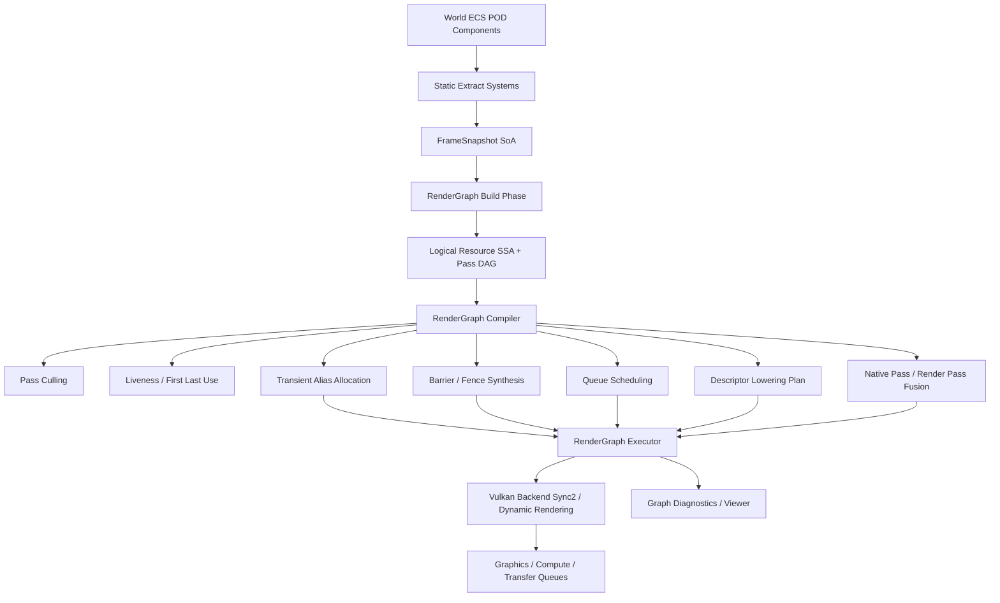

# RenderGraph 彻底重构最终开发规划书

> 目标读者：AI 编码助手 / 工程实现者  
> 适用项目：`chenhuawang-04/Render` / `VulkanRender_New`  
> 设计目标：不计代价，接受任意程度重构，彻底转向干净、高性能、现代化、数据导向的 RenderGraph 架构。  
> 最终原则：**RenderGraph 是唯一渲染调度中心；SceneRecorder / RenderTargetPool / 手写 Barrier 编排必须被拆解、吸收或删除。**

---

## 0. 审查结论

上一版计划的总体方向是正确的：应引入“逻辑资源 SSA + Pass DAG + 图编译器”，让 RenderGraph 接管资源生命周期、Pass 顺序、Barrier、队列调度、瞬态内存和诊断系统。

但上一版计划仍然偏保守，主要问题如下：

1. **过度强调包裹式迁移。**  
   在“不计代价、接受彻底重构”的目标下，不应长期保留 legacy SceneRecorder 主路径。可以短期保留旧代码用于对照，但不能让旧路径继续参与主线架构设计。

2. **RenderTargetPool 的地位需要下调。**  
   旧 `RenderTargetPool` 只能做描述符相同的对象复用，不等价于 RenderGraph transient aliasing。最终应由 `RenderGraphTransientAllocator` 接管图级 lifetime/alias 分配；旧 pool 最多作为临时物理缓存或被删除。

3. **FrameScheduler 不能只是提交辅助。**  
   它应升级为 `RenderGraphQueueScheduler`，根据编译后的 DAG 生成 graphics / compute / transfer queue submit plan、timeline semaphore、queue ownership transfer 和跨队列依赖。

4. **SceneRecorder2D/3D 不应继续作为“录制器”。**  
   它们应被拆解为纯函数式 graph builder / graph feature modules，例如 `AddScene3DGraph()`、`AddBloomGraph()`、`AddShadowGraph()`。

5. **应更强烈贯彻项目已有思想：POD ECS + 静态系统 + Concept。**  
   继承多态不应成为 RenderGraph 扩展机制。优先使用 C++23 concepts、静态系统、值语义 descriptor、typed handle、arena storage、type-erased pass payload 仅限图内部冷路径。

6. **主路径应 graph-only。**  
   重构最终状态下，任何高层渲染模块都不得直接调用 Vulkan barrier、不得直接决定 RenderTarget final state、不得直接 acquire/release transient render target。

因此，本最终规划书采用“**干净重构方案**”，而不是“渐进兼容方案”。

---

## 1. 最终架构目标

### 1.1 必须达成的最终状态

最终主线架构必须满足：

- RenderGraph 是渲染帧内执行的唯一调度中心。
- ECS / Scene / Runtime 只生产帧数据，不直接录制渲染顺序。
- 所有 Pass 通过声明式 API 描述：
  - 读哪些资源；
  - 写哪些资源；
  - 使用何种访问语义；
  - 偏好哪个队列；
  - 是否有副作用；
  - 是否允许裁剪、合并、异步调度。
- 所有 GPU 资源状态转换由 RenderGraph 编译器推导。
- 所有 transient texture/buffer 生命周期由 RenderGraph liveness 分析和 transient allocator 决定。
- 所有跨队列同步由 queue scheduler 自动生成。
- 所有最终输出、present、readback、query、debug capture 都是 side-effect rooted pass。
- 高层渲染模块不得出现 `VkImageLayout`、`VkPipelineStageFlags2`、`VkAccessFlags2`、`vkCmdPipelineBarrier2`。
- Vulkan 只是首个后端，RenderGraph 前端必须 backend-neutral。
- 旧 `SceneRecorder2D` / `SceneRecorder3D` 的 Record 编排逻辑最终删除。
- 旧 `SceneRenderTargetSet` / `SceneBloomPostStack` / `RenderTargetCompositeRenderer` 最终转成 graph feature functions。
- 旧 `RenderTargetPool` 最终删除或降级为 backend 内部 cache，不得暴露给 Scene 层。

### 1.2 不接受的设计

以下设计一律视为不合格：

- 在 SceneRecorder 中继续手写 pass 顺序。
- 在 renderer 中继续手写 render target transition。
- 让 ECS entity/component 直接成为 graph node。
- 以继承虚函数作为 pass/feature 扩展主机制。
- 把 Vulkan layout/state 暴露到 RenderGraph 前端。
- 只做 postprocess graph，而主 scene path 仍是命令式。
- RenderGraph 只负责调试可视化，不负责实际资源和同步。
- graph path 与 legacy path 长期双轨维护。
- 只做对象池，不做 liveness / alias allocator。
- 只做单 graphics queue，没有为 async compute / transfer queue 留出真实调度模型。

---

## 2. 与项目思想的对齐

项目现有方向包括：

- C++23；
- Vulkan 1.3；
- Runtime Service / Profile；
- ECS 全 POD 组件；
- 静态系统；
- Frame Coordinator；
- RenderView / ScenePacket；
- RenderTarget / Upload / Descriptor / Pipeline Host；
- 测试和 bench 体系。

最终 RenderGraph 设计必须继承这些思想，但要纠正“手工编排越来越重”的问题。

### 2.1 ECS 的位置

ECS 不进入图执行器。

正确边界：

```text
World ECS
  -> Extract Systems
  -> FrameSnapshot / FrameViewSnapshot / DrawPacket SoA
  -> RenderGraph build
  -> RenderGraph compile
  -> Backend execute
```

错误边界：

```text
World ECS
  -> RenderGraph directly scans entities
  -> each entity becomes pass or node
```

原因：

- entity 粒度太细，会导致图规模爆炸；
- ECS 遍历顺序和指针地址不适合作为图缓存 key；
- 业务状态不应污染资源依赖图；
- RenderGraph 应消费已经排序、裁剪、批处理后的 frame data。

### 2.2 Concept / 静态多态优先

RenderGraph feature 扩展应采用：

- `concept GraphFeature`
- `concept GraphPassBuilder`
- `concept BackendLowering`
- `constexpr` flags
- CRTP 或 free function
- POD descriptor
- typed handles

不采用：

- pass 基类虚函数；
- renderer inheritance hierarchy；
- runtime polymorphic mega-interface；
- 在 hot path 中使用 `std::function`。

允许有限 type erasure：

- 图内部存储 pass execute thunk；
- debug metadata；
- 非 hot path 的 tooling hook。

### 2.3 Runtime Service 的定位

Runtime Service 保留，但 RenderGraph 成为核心服务之一：

```text
Runtime
  - Platform / VulkanContext
  - GpuMemory
  - Upload
  - Descriptor
  - Pipeline
  - RenderGraph
  - Diagnostics
```

Renderer feature 不再以“可单独调度的 recorder service”存在，而是以 graph feature 形式注册到 RenderGraph build pipeline。

---

## 3. 新目标架构



---

## 4. 新模块布局

### 4.1 新增核心目录

```text
include/vr/render_graph/
src/render_graph/
```

### 4.2 RenderGraph 前端

```text
include/vr/render_graph/rg_handle.hpp
include/vr/render_graph/rg_resource_desc.hpp
include/vr/render_graph/rg_access.hpp
include/vr/render_graph/rg_pass.hpp
include/vr/render_graph/rg_builder.hpp
include/vr/render_graph/rg_feature.hpp
include/vr/render_graph/rg_frame_snapshot.hpp
```

### 4.3 RenderGraph 编译器

```text
include/vr/render_graph/rg_compiler.hpp
include/vr/render_graph/rg_dag.hpp
include/vr/render_graph/rg_liveness.hpp
include/vr/render_graph/rg_culling.hpp
include/vr/render_graph/rg_queue_scheduler.hpp
include/vr/render_graph/rg_barrier_plan.hpp
include/vr/render_graph/rg_alias_allocator.hpp
include/vr/render_graph/rg_native_pass_fusion.hpp
include/vr/render_graph/rg_descriptor_plan.hpp
```

### 4.4 RenderGraph 执行器

```text
include/vr/render_graph/rg_executor.hpp
include/vr/render_graph/rg_command_context.hpp
include/vr/render_graph/rg_physical_resource_table.hpp
include/vr/render_graph/rg_runtime_service.hpp
```

### 4.5 Vulkan 后端

```text
include/vr/render_graph/vulkan/rg_vulkan_backend.hpp
include/vr/render_graph/vulkan/rg_vulkan_access_table.hpp
include/vr/render_graph/vulkan/rg_vulkan_resource_allocator.hpp
include/vr/render_graph/vulkan/rg_vulkan_barrier_emitter.hpp
include/vr/render_graph/vulkan/rg_vulkan_queue_submitter.hpp
include/vr/render_graph/vulkan/rg_vulkan_dynamic_rendering.hpp
include/vr/render_graph/vulkan/rg_vulkan_descriptor_lowering.hpp
```

### 4.6 Graph Features

```text
include/vr/render_graph/features/scene_2d_graph.hpp
include/vr/render_graph/features/scene_3d_graph.hpp
include/vr/render_graph/features/shadow_graph.hpp
include/vr/render_graph/features/light_graph.hpp
include/vr/render_graph/features/sky_environment_graph.hpp
include/vr/render_graph/features/bloom_graph.hpp
include/vr/render_graph/features/composite_graph.hpp
include/vr/render_graph/features/particle_graph.hpp
include/vr/render_graph/features/ibl_bake_graph.hpp
include/vr/render_graph/features/text_graph.hpp
include/vr/render_graph/features/geometry_graph.hpp
include/vr/render_graph/features/surface_graph.hpp
```

### 4.7 Debug / Tooling

```text
include/vr/render_graph/debug/rg_debug_dump.hpp
include/vr/render_graph/debug/rg_dot_export.hpp
include/vr/render_graph/debug/rg_json_export.hpp
include/vr/render_graph/debug/rg_memory_timeline_export.hpp
include/vr/render_graph/debug/rg_validation.hpp
```

---

## 5. 必删 / 必改旧模块

### 5.1 最终删除或重写

| 旧模块 | 处理方式 |
|---|---|
| `SceneRecorder2D` | 删除 Record 编排逻辑，替换为 `AddScene2DGraph()` |
| `SceneRecorder3D` | 删除 Record 编排逻辑，替换为 `AddScene3DGraph()` |
| `SceneRenderTargetSet` | 转为 graph resource presets，不再持有实际 RT 生命周期 |
| `SceneBloomPostStack` | 转为 `AddBloomGraph()` |
| `RenderTargetCompositeRenderer` | 转为 `AddCompositeGraph()` |
| `RenderTargetBloomRenderer` | 拆成 Bloom feature passes |
| `RenderTargetPass` | 废弃旧式 render pass preset 编排，后端由 graph dynamic rendering/native fusion 生成 |
| 高层 `RecordTransition()` 调用 | 全部删除 |
| 手写 final state 配置 | 全部删除，由 graph final access 计算 |
| Renderer 内部 target ownership | 删除，renderer 只消费 pass context resource views |

### 5.2 保留但降级为后端基础设施

| 模块 | 新职责 |
|---|---|
| `RenderTargetHost` | Vulkan image/view 物理资源创建工具 |
| `GpuMemoryHost` | persistent/default memory backend |
| `DescriptorHost` | descriptor allocation / update backend |
| `PipelineHost` | pipeline cache backend |
| `UploadHost` | upload ring / staging backend，提交由 graph 控制 |
| `FrameCommandHost` | command pool / command buffer backend |
| `FrameSyncHost` | timeline/fence backend |
| `FrameRetireHost` | GPU-safe delayed destruction backend |
| `FrameScheduler` | 升级或替换为 `RenderGraphQueueScheduler` |

### 5.3 RenderTargetPool 的最终命运

短期可以借用，但最终应被替换：

```text
RenderTargetPool
  -> temporary bridge only
  -> replaced by RenderGraphTransientAllocator
```

最终 `RenderGraphTransientAllocator` 必须基于：

- resource lifetime interval；
- compatibility class；
- memory type；
- queue overlap；
- alias barrier requirements；
- transient attachment/lazy memory；
- allocation page reuse；
- graph compile plan。

---

## 6. 核心数据模型

### 6.1 Handle

```cpp
namespace vr::rg {

struct TextureHandle final {
    std::uint32_t id = 0;
    std::uint16_t version = 0;
};

struct BufferHandle final {
    std::uint32_t id = 0;
    std::uint16_t version = 0;
};

struct PassHandle final {
    std::uint32_t id = 0;
};

struct ResourceVersion final {
    std::uint32_t id = 0;
    std::uint16_t version = 0;
};

}
```

要求：

- handle 是纯值；
- 不含指针；
- 可哈希；
- debug build 中带 generation validation；
- release build 零额外开销。

### 6.2 Resource Desc

```cpp
enum class ResourceLifetime : std::uint8_t {
    Imported,
    Persistent,
    Transient,
};

enum class TextureDimension : std::uint8_t {
    Tex1D,
    Tex2D,
    Tex3D,
    Cube,
};

struct TextureDesc final {
    TextureDimension dimension = TextureDimension::Tex2D;
    std::uint32_t width = 1;
    std::uint32_t height = 1;
    std::uint32_t depth = 1;
    std::uint16_t mip_count = 1;
    std::uint16_t layer_count = 1;
    Format format = Format::Unknown;
    SampleCount samples = SampleCount::x1;
    TextureUsageFlags usage{};
    ResourceLifetime lifetime = ResourceLifetime::Transient;
    bool allow_alias = true;
    bool allow_uav = false;
    bool allow_history = false;
    bool prefer_lazy_memory = false;
    const char* debug_name = nullptr;
};

struct BufferDesc final {
    std::uint64_t size = 0;
    BufferUsageFlags usage{};
    ResourceLifetime lifetime = ResourceLifetime::Transient;
    bool allow_alias = true;
    bool host_visible = false;
    const char* debug_name = nullptr;
};
```

### 6.3 Access Model

```cpp
enum class AccessKind : std::uint16_t {
    None,

    ColorAttachmentRead,
    ColorAttachmentWrite,

    DepthStencilRead,
    DepthStencilWrite,
    DepthStencilReadWrite,

    ShaderSampleRead,
    ShaderStorageRead,
    ShaderStorageWrite,
    ShaderStorageReadWrite,

    UniformRead,
    VertexBufferRead,
    IndexBufferRead,
    IndirectCommandRead,

    TransferRead,
    TransferWrite,

    Present,
    HostRead,
    HostWrite,
};

enum class QueueClass : std::uint8_t {
    Graphics,
    Compute,
    Transfer,
};

struct AccessDesc final {
    ResourceVersion resource{};
    AccessKind access = AccessKind::None;
    SubresourceRange range{};
};
```

规则：

- Read 不改变版本。
- Write 生成新版本。
- ReadWrite 生成新版本，并依赖旧版本。
- Present 是 side effect。
- HostRead / HostWrite 必须形成 queue boundary。
- StorageWrite / StorageReadWrite 需要 UAV/order hazard 语义。
- Subresource range 必须参与 hazard 检测。

---

## 7. RenderGraph Builder API

### 7.1 Graph Builder

```cpp
class RenderGraphBuilder final {
public:
    TextureHandle ImportTexture(std::string_view name, const ImportedTextureDesc& desc);
    BufferHandle ImportBuffer(std::string_view name, const ImportedBufferDesc& desc);

    TextureHandle CreateTexture(std::string_view name, const TextureDesc& desc);
    BufferHandle CreateBuffer(std::string_view name, const BufferDesc& desc);

    template<class PassData, class SetupFn, class ExecuteFn>
    PassHandle AddRasterPass(std::string_view name, SetupFn&& setup, ExecuteFn&& execute);

    template<class PassData, class SetupFn, class ExecuteFn>
    PassHandle AddComputePass(std::string_view name, SetupFn&& setup, ExecuteFn&& execute);

    template<class PassData, class SetupFn, class ExecuteFn>
    PassHandle AddTransferPass(std::string_view name, SetupFn&& setup, ExecuteFn&& execute);
};
```

### 7.2 Pass Builder

```cpp
class PassBuilder final {
public:
    TextureHandle Read(TextureHandle texture, AccessKind access, SubresourceRange range = {});
    BufferHandle Read(BufferHandle buffer, AccessKind access, BufferRange range = {});

    TextureHandle Write(TextureHandle texture, AccessKind access, SubresourceRange range = {});
    BufferHandle Write(BufferHandle buffer, AccessKind access, BufferRange range = {});

    TextureHandle UseColorAttachment(TextureHandle texture, std::uint32_t index, LoadStoreDesc load_store);
    TextureHandle UseDepthStencil(TextureHandle texture, DepthStencilUse use, LoadStoreDesc load_store);

    TextureHandle CreateTransientTexture(std::string_view name, const TextureDesc& desc);
    BufferHandle CreateTransientBuffer(std::string_view name, const BufferDesc& desc);

    void SetQueue(QueueClass queue);
    void EnableAsyncCompute(bool value = true);
    void AllowCulling(bool value = true);
    void AllowNativePassFusion(bool value = true);
    void MarkSideEffect();
    void SetDebugColor(std::uint32_t rgba);
};
```

### 7.3 Execute Context

```cpp
class GraphCommandContext final {
public:
    VkCommandBuffer CommandBuffer() const noexcept;

    TextureView Resolve(TextureHandle texture) const;
    BufferView Resolve(BufferHandle buffer) const;

    DescriptorWriteContext Descriptors();
    PipelineBindContext Pipelines();

    void BeginDebugLabel(std::string_view name);
    void EndDebugLabel();
};
```

约束：

- Execute 阶段只能 resolve setup 阶段声明过的资源。
- 未声明资源在 debug build 直接 assert。
- release build 中 validation 可编译关闭。

---

## 8. Feature API：替代旧 SceneRecorder

### 8.1 Graph Feature Concept

```cpp
template<class T>
concept GraphFeature = requires(T feature, RenderGraphBuilder& rg, const FrameSnapshot& frame) {
    { T::Name } -> std::convertible_to<std::string_view>;
    feature.Build(rg, frame);
};
```

### 8.2 Scene 3D Feature

```cpp
struct Scene3DGraphFeature final {
    static constexpr std::string_view Name = "Scene3D";

    void Build(RenderGraphBuilder& rg,
               const FrameSnapshot& frame,
               const Scene3DGraphConfig& config);
};
```

内部调用：

```cpp
AddShadowGraph(rg, frame, shadow_config);
AddSkyEnvironmentGraph(rg, frame, sky_config);
AddOpaqueSceneGraph(rg, frame, scene_config);
AddTransparentSceneGraph(rg, frame, scene_config);
AddBloomGraph(rg, frame, bloom_config);
AddOverlayGraph(rg, frame, overlay_config);
AddCompositeGraph(rg, frame, composite_config);
AddPresentGraph(rg, frame, present_config);
```

### 8.3 旧 Renderer 的新形态

旧 renderer 不再是“自己决定目标和状态”的对象，而变成：

```cpp
struct Geometry3DGraphPass final {
    static void Build(RenderGraphBuilder& rg, const Geometry3DFrameData& data);
};

struct Surface3DGraphPass final {
    static void Build(RenderGraphBuilder& rg, const Surface3DFrameData& data);
};

struct Text3DGraphPass final {
    static void Build(RenderGraphBuilder& rg, const Text3DFrameData& data);
};
```

Renderer 内部只保留：

- pipeline creation；
- descriptor binding；
- draw encoding；
- shader contract；
- static draw packet consumption。

---

## 9. FrameSnapshot 与 ECS 抽取

### 9.1 新增 FrameSnapshot

```cpp
struct FrameSnapshot final {
    std::uint64_t frame_index = 0;
    FrameViewportSet views;
    GeometryFrameData geometry;
    SurfaceFrameData surface;
    TextFrameData text;
    LightFrameData lights;
    ShadowFrameData shadows;
    ParticleFrameData particles;
    SkyEnvironmentFrameData sky;
    IblFrameData ibl;
    UploadFrameData uploads;
};
```

### 9.2 View Snapshot

```cpp
struct FrameViewSnapshot final {
    ViewId id;
    RenderViewKind kind;
    std::uint32_t flags;
    std::uint32_t layer_mask;
    std::uint32_t culling_mask;
    Viewport viewport;
    Scissor scissor;
    CameraGpuData camera;
    BackgroundSnapshot background;
    std::uint64_t stable_signature;
};
```

要求：

- 不包含 camera 指针；
- 不包含 transform 指针；
- 不包含 raw ECS pointer；
- `stable_signature` 只能由值语义字段和 revision 组成；
- 可跨运行复现。

### 9.3 抽取系统

新增：

```text
include/vr/render_graph/extract/frame_extraction.hpp
include/vr/render_graph/extract/view_extraction.hpp
include/vr/render_graph/extract/geometry_extraction.hpp
include/vr/render_graph/extract/surface_extraction.hpp
include/vr/render_graph/extract/text_extraction.hpp
include/vr/render_graph/extract/light_extraction.hpp
include/vr/render_graph/extract/shadow_extraction.hpp
include/vr/render_graph/extract/particle_extraction.hpp
```

所有抽取系统是静态系统：

```cpp
struct GeometryExtractionSystem final {
    static void Extract(const WorldView& world, FrameArena& arena, GeometryFrameData& out);
};
```

---

## 10. 编译器设计

### 10.1 Compile Pipeline

```text
Build Logical Graph
  -> Validate Declarations
  -> Resource SSA Versioning
  -> DAG Construction
  -> Topological Sort
  -> Side Effect Root Collection
  -> Pass Culling
  -> Liveness Analysis
  -> Queue Assignment
  -> Native Pass Fusion
  -> Transient Alias Allocation
  -> Barrier/Fence Synthesis
  -> Descriptor Lowering Plan
  -> Command Recording Plan
  -> Submit Plan
  -> Diagnostics Export
```

### 10.2 Compile Result

```cpp
struct CompiledRenderGraph final {
    Span<CompiledPass> passes;
    Span<CompiledResource> resources;
    Span<CompiledBarrierBatch> barrier_batches;
    Span<CompiledSubmitBatch> submit_batches;
    Span<NativePassGroup> native_pass_groups;
    TransientAllocationPlan transient_allocations;
    DescriptorBindingPlan descriptor_plan;
    RenderGraphDiagnostics diagnostics;
};
```

### 10.3 Pass Culling

保留：

- side effect pass；
- present pass；
- readback pass；
- exported resource producer；
- GPU query pass；
- debug capture pass；
- imported resource write pass；
- manually marked non-cullable pass。

裁剪：

- 输出无人读取的 pure pass；
- debug disabled pass；
- feature disabled pass；
- postprocess disabled pass；
- empty draw packet pass。

### 10.4 Liveness

```cpp
struct ResourceLiveness final {
    ResourceVersion resource;
    std::uint32_t first_pass = invalid;
    std::uint32_t last_pass = invalid;
    QueueClass first_queue = QueueClass::Graphics;
    QueueClass last_queue = QueueClass::Graphics;
    bool escapes_frame = false;
    bool may_alias = false;
};
```

### 10.5 Queue Scheduling

队列策略：

- Raster pass 默认 Graphics。
- Compute pass 默认 Compute；若 backend 不支持则 fallback Graphics。
- Transfer pass 默认 Transfer；若 backend 不支持则 fallback Graphics。
- Async compute 只在收益明确且 hazard 可证明时启用。
- Queue overlap 必须尊重 liveness 和 barrier。
- 跨队列 resource ownership / visibility 由 scheduler 生成。

输出：

```cpp
struct CompiledSubmitBatch final {
    QueueClass queue;
    Span<CompiledPassId> passes;
    Span<QueueWait> waits;
    Span<QueueSignal> signals;
};
```

### 10.6 Native Pass Fusion

目标：

- 合并连续 raster pass；
- 减少 load/store；
- 减少 attachment round-trip；
- 利用 Vulkan dynamic rendering；
- 预留 dynamic rendering local read；
- 移动/TBR 优化。

合并条件：

- 同队列；
- 无中间 shader sample；
- attachment compatible；
- viewport/scissor compatible；
- load/store 可合并；
- 无外部 side effect；
- 无强制 debug split；
- 无 queue boundary。

### 10.7 Barrier Synthesis

统一逻辑 barrier：

```cpp
struct LogicalBarrier final {
    ResourceVersion resource;
    AccessKind before;
    AccessKind after;
    QueueClass src_queue;
    QueueClass dst_queue;
    SubresourceRange range;
    bool queue_transfer = false;
    bool aliasing = false;
    bool uav_ordering = false;
};
```

Vulkan lowering 表：

```cpp
struct VulkanAccessInfo final {
    VkPipelineStageFlags2 stage;
    VkAccessFlags2 access;
    VkImageLayout layout;
};
```

所有 Vulkan barrier 由后端统一生成，禁止高层生成。

---

## 11. Transient Alias Allocator

### 11.1 目标

替代旧 `RenderTargetPool`，实现真正图级瞬态内存复用。

### 11.2 Compatibility Class

资源可 alias 的条件：

- resource kind 相同；
- memory type compatible；
- format compatible 或 backend 允许；
- usage compatible；
- sample count compatible；
- dimension compatible；
- alignment compatible；
- lifetime 不重叠；
- queue 不并发冲突；
- 没有 imported / external / history escape；
- 没有 `allow_alias = false`。

### 11.3 算法

```text
Group resources by compatibility class
  -> sort by size descending
  -> interval coloring by [first_pass, last_pass]
  -> assign memory page / heap offset
  -> insert alias barrier if required
  -> output memory timeline
```

### 11.4 Vulkan 策略

第一实现可采用保守 alias：

- 先支持 transient buffer alias；
- 再支持 transient image alias；
- 对 depth/MSAA/format-sensitive image 默认 opt-in；
- 对 tile GPU 支持 lazy transient attachment；
- debug build 验证所有 alias interval 不重叠。

---

## 12. Descriptor 与 Binding

### 12.1 目标

最终所有 pass 资源绑定从 graph 声明生成。

Descriptor 层次：

```text
Graph resource declaration
  -> pass-local binding requirements
  -> shader reflection contract validation
  -> descriptor allocation
  -> descriptor write plan
  -> bind during execute
```

### 12.2 Descriptor Plan

```cpp
struct DescriptorBindingPlan final {
    Span<PassDescriptorLayout> pass_layouts;
    Span<DescriptorWriteBatch> writes;
    Span<BindlessAllocation> bindless_allocations;
};
```

### 12.3 Shader Contract

必须校验：

- shader set/binding 存在；
- resource type 匹配；
- sampled/storage/ubo/ssbo 匹配；
- access kind 匹配；
- array/bindless index 合法；
- pass 声明资源都被绑定；
- 绑定资源都已声明。

---

## 13. Runtime 集成

### 13.1 新 Runtime 阶段语义

```text
BeginFrame
  - reset graph arenas
  - reset frame resource tables

Prepare
  - ECS extraction
  - build FrameSnapshot
  - collect upload requests

PreRecord
  - build RenderGraph
  - compile RenderGraph
  - allocate transient resources
  - prepare descriptor plan

Record
  - parallel command recording
  - emit barriers
  - execute passes

Submit
  - submit graphics / compute / transfer batches
  - signal timelines

Present
  - present side-effect pass result

Retire
  - retire transient allocations
  - retire imported views if needed
  - collect backend resources

Diagnostics
  - export graph stats
  - export memory timeline
  - export barrier dump
```

### 13.2 RenderGraphRuntimeService

```cpp
struct RenderGraphRuntimeService final {
    using CreateInfo = RenderGraphRuntimeCreateInfo;
    using Dependencies = ServiceDependencies<
        GpuMemoryService,
        DescriptorService,
        PipelineService,
        UploadService,
        CommandService,
        FrameRetireService
    >;

    static constexpr std::string_view Name = "RenderGraph";

    void Initialize(auto& context);
    void BeginFrame(auto& context);
    void PrepareFrame(auto& context);
    void PreRecord(auto& context);
    void Record(auto& context);
    void Submit(auto& context);
    void Retire(auto& context);
    void Shutdown(auto& context);
};
```

Use concepts, not virtual inheritance.

---

## 14. Backend Abstraction

### 14.1 Backend Concept

```cpp
template<class T>
concept RenderGraphBackend = requires(
    T backend,
    const CompiledRenderGraph& graph,
    GraphExecutionContext& context
) {
    backend.Allocate(graph, context);
    backend.Record(graph, context);
    backend.Submit(graph, context);
    backend.Retire(graph, context);
};
```

### 14.2 Vulkan Backend

Vulkan backend must implement:

- Sync2 barriers;
- dynamic rendering;
- timeline semaphore submission;
- queue family ownership transfer;
- transfer queue;
- compute queue;
- graphics queue;
- transient image/buffer allocation;
- descriptor lowering;
- debug labels;
- GPU timestamp hooks;
- validation-friendly naming.

---

## 15. 并行与性能策略

### 15.1 CPU 性能

必须使用：

- frame arena allocator；
- stable ID arrays；
- dense vectors；
- small-vector optimization；
- sorted integer IDs；
- bitsets for reachability；
- no per-pass heap allocation during compile hot path；
- no virtual dispatch in pass iteration；
- no unordered_map in hot compile loops unless pre-reserved and measured；
- graph compile cache keyed by stable descriptors；
- parallel command recording by native pass group / queue batch。

### 15.2 GPU 性能

必须实现：

- pass culling；
- transient aliasing；
- native pass fusion；
- load/store optimization；
- async transfer；
- async compute；
- barrier minimization；
- UAV barrier minimization；
- layout transition batching；
- descriptor update batching；
- render target lazy allocation where available；
- no unnecessary store for transient attachments；
- no unnecessary clear/load。

### 15.3 诊断指标

每帧记录：

```text
graph_build_us
graph_compile_us
pass_count_declared
pass_count_culled
pass_count_executed
resource_count
transient_texture_count
transient_buffer_count
transient_peak_bytes
alias_saved_bytes
barrier_count
image_barrier_count
buffer_barrier_count
uav_barrier_count
alias_barrier_count
submit_batch_count
graphics_pass_count
compute_pass_count
transfer_pass_count
native_pass_group_count
descriptor_write_count
```

---

## 16. 实施阶段

## Phase 0：重构准备与基线冻结

目标：建立 graph-only 重构分支，不再围绕长期兼容设计。

任务：

- 创建 `feature/rendergraph-rewrite` 分支。
- 冻结当前 master 作为 legacy reference。
- 新增 `docs/render_graph_final_plan.md`。
- 新增 `include/vr/render_graph` 和 `src/render_graph`。
- 新增 `VR_ENABLE_RENDER_GRAPH_REWRITE`，默认 ON。
- legacy path 只允许作为测试对照，不允许新增功能。
- 建立 graph debug output 目录。

验收：

- 构建通过；
- 新目录进入 CMake；
- 空 RenderGraph service 可初始化；
- 文档进入仓库。

---

## Phase 1：核心前端与纯 CPU 编译器

目标：实现不依赖 Vulkan 的 RenderGraph 前端和编译器。

任务：

- handle；
- resource desc；
- access desc；
- pass desc；
- builder；
- write versioning；
- DAG；
- topological sort；
- side-effect root；
- culling；
- liveness；
- diagnostics；
- DOT / JSON export。

测试：

```text
render_graph_handle_tests.cpp
render_graph_builder_tests.cpp
render_graph_versioning_tests.cpp
render_graph_dag_tests.cpp
render_graph_culling_tests.cpp
render_graph_liveness_tests.cpp
render_graph_debug_export_tests.cpp
```

验收：

- CPU-only tests 全过；
- fuzz 生成 10k 随机图无错误；
- DOT 可正确显示 pass/resource edges；
- culling 结果可解释。

---

## Phase 2：FrameSnapshot 与 ECS 抽取

目标：把 RenderView/ScenePacket 指针语义改为稳定值语义 snapshot。

任务：

- 新增 `FrameSnapshot`；
- 新增 `FrameViewSnapshot`；
- 修改 scene submission builder 输出 snapshot；
- 将 camera/transform 指针转换为 GPU-ready values；
- 为 Geometry/Surface/Text/Light/Shadow/Particle 建立 SoA frame data；
- 删除 graph build 中对 ECS world 的直接访问。

测试：

```text
frame_snapshot_tests.cpp
view_snapshot_signature_tests.cpp
ecs_frame_extraction_tests.cpp
scene_submission_snapshot_tests.cpp
```

验收：

- snapshot 不含 raw ECS pointer；
- stable signature 不含地址；
- fixed input 多次运行 signature 一致；
- existing scene data 可完整抽取。

---

## Phase 3：Vulkan Resource Backend

目标：逻辑资源能映射成 Vulkan 物理资源。

任务：

- `TextureDesc -> VkImageCreateInfo`；
- `BufferDesc -> VkBufferCreateInfo`；
- imported texture/buffer；
- persistent texture/buffer；
- transient texture/buffer；
- physical resource table；
- resource naming；
- integration with `GpuMemoryHost` / `ImageHost` / `BufferHost`。

测试：

```text
rg_vulkan_texture_allocation_tests.cpp
rg_vulkan_buffer_allocation_tests.cpp
rg_imported_resource_tests.cpp
rg_physical_resource_table_tests.cpp
```

验收：

- imported swapchain texture 可注册；
- transient color/depth texture 可创建；
- buffer resource 可创建；
- resource table resolve 正确；
- shutdown 无泄漏。

---

## Phase 4：Barrier / Fence / Queue Scheduler

目标：RenderGraph 接管所有状态转换和队列同步。

任务：

- access kind to Vulkan stage/access/layout table；
- image barrier synthesis；
- buffer barrier synthesis；
- storage/UAV ordering；
- alias barrier model；
- queue ownership transfer；
- timeline wait/signal plan；
- submit batch generation；
- remove high-level manual transition calls。

测试：

```text
rg_barrier_image_tests.cpp
rg_barrier_buffer_tests.cpp
rg_barrier_uav_tests.cpp
rg_cross_queue_tests.cpp
rg_present_transition_tests.cpp
```

验收：

- validation layer clean；
- 不允许 Scene/Feature 层调用 `vkCmdPipelineBarrier2`；
- 不允许 Scene/Feature 层调用 `RenderTargetHost::RecordTransition`；
- barrier dump 完整。

---

## Phase 5：Executor 与 Dynamic Rendering

目标：RenderGraph 可实际录制并 present。

任务：

- command context；
- pass execution thunk；
- dynamic rendering begin/end；
- color/depth attachment setup；
- load/store lowering；
- present pass；
- debug label；
- timestamp hook；
- single graphics queue first；
- then transfer/compute queue。

测试：

```text
rg_executor_smoke_tests.cpp
rg_dynamic_rendering_tests.cpp
rg_present_tests.cpp
runtime_render_graph_single_frame_tests.cpp
```

验收：

- 最小 clear-to-swapchain graph 可显示；
- present 正确；
- resize 正确；
- validation clean。

---

## Phase 6：彻底替换 SceneRecorder3D

目标：删除 3D 手写录制主路径。

任务：

- 新增 `scene_3d_graph.hpp/cpp`；
- shadow pass graph 化；
- sky environment graph 化；
- opaque geometry/surface/text graph 化；
- transparent graph 化；
- particle 3D graph 化；
- bloom graph 化；
- overlay graph 化；
- composite graph 化；
- present graph 化；
- 删除 `SceneRecorder3D::Record` 主路径；
- 删除 SceneRecorder3D 中 target final state / post stack hand-written logic。

测试：

```text
runtime_scene_3d_render_graph_tests.cpp
scene_3d_graph_feature_tests.cpp
shadow_graph_tests.cpp
bloom_graph_tests.cpp
```

验收：

- 3D unified demo 走 graph-only；
- legacy SceneRecorder3D 不再参与主线；
- shadow/light/sky/bloom/text/particle 全功能等价或更优；
- no manual transition；
- no manual transient RT acquire in Scene3D。

---

## Phase 7：彻底替换 SceneRecorder2D / FrameComposer

目标：2D 和最终合成也 graph-only。

任务：

- `scene_2d_graph`；
- background graph；
- geometry 2D graph；
- surface 2D graph；
- text 2D graph；
- particle 2D graph；
- overlay graph；
- frame composer graph；
- 删除旧 2D recorder 主路径；
- 删除旧 composer 主路径。

测试：

```text
runtime_scene_2d_render_graph_tests.cpp
runtime_frame_composer_graph_tests.cpp
background_2d_graph_tests.cpp
```

验收：

- 2D demos graph-only；
- text/surface/particle demos graph-only；
- frame composer 不再手写 target pipeline。

---

## Phase 8：Descriptor Lowering 与 Shader Contract

目标：资源绑定由 graph 声明驱动。

任务：

- pass binding declaration；
- descriptor plan；
- reflection contract integration；
- descriptor cache；
- transient descriptor staging；
- bindless table；
- validation；
- remove renderer-owned transient descriptor assumptions。

测试：

```text
rg_descriptor_plan_tests.cpp
rg_shader_contract_tests.cpp
rg_bindless_tests.cpp
```

验收：

- shader binding 与 graph resource declaration 一致；
- 未声明资源绑定会失败；
- 声明未绑定会失败；
- descriptor writes 批量化。

---

## Phase 9：Transient Alias Allocator

目标：替代 RenderTargetPool。

任务：

- compatibility class；
- interval coloring；
- memory pages；
- alias barrier；
- image alias opt-in；
- buffer alias default；
- lazy transient attachment；
- memory timeline export；
- remove RenderTargetPool from graph-facing APIs。

测试：

```text
rg_alias_allocator_tests.cpp
rg_alias_barrier_tests.cpp
rg_memory_timeline_tests.cpp
runtime_transient_memory_bench.cpp
```

验收：

- alias saved bytes > 0 in postprocess/shadow scenes；
- no overlapping lifetime alias bug；
- RenderTargetPool 不再被 Scene/Feature 层引用；
- transient peak memory 可诊断。

---

## Phase 10：Async Compute / Transfer / Advanced Scheduling

目标：充分发挥现代 GPU 显式多队列能力。

任务：

- Upload transfer pass；
- particle compute pass；
- IBL bake compute pass；
- HiZ / culling compute pass；
- async bloom path if beneficial；
- overlap analysis；
- queue wait/signal minimization；
- queue timeline viewer。

测试：

```text
rg_async_compute_tests.cpp
rg_transfer_queue_tests.cpp
runtime_particle_async_tests.cpp
runtime_ibl_async_tests.cpp
```

验收：

- unsupported device fallback graphics；
- supported device 使用 compute/transfer queue；
- no queue hazard；
- queue timeline dump 可读；
- async path benchmark 不退化，或可自动关闭。

---

## Phase 11：Native Pass Fusion / TBR 优化

目标：减少带宽和 pass overhead。

任务：

- native pass grouping；
- dynamic rendering local read path；
- load/store optimizer；
- transient store elimination；
- attachment clear/load inference；
- tile-friendly path；
- debug split override。

测试：

```text
rg_native_pass_fusion_tests.cpp
rg_load_store_optimizer_tests.cpp
rg_tbr_policy_tests.cpp
```

验收：

- 可解释 pass merge；
- 无不合法 merge；
- store count 降低；
- bandwidth-sensitive scenes 有收益；
- debug 可强制关闭 fusion。

---

## Phase 12：清理旧架构

目标：彻底删除 legacy 编排。

任务：

- 删除 legacy SceneRecorder record code；
- 删除旧 SceneRenderTargetSet lifecycle；
- 删除旧 SceneBloomPostStack lifecycle；
- 删除 RenderTargetPool public graph usage；
- 删除手写 final state；
- 删除 renderer target ownership；
- 更新 docs/file_index；
- 更新 architecture manual；
- 更新 examples；
- 更新 tests；
- 删除临时 compatibility flags。

验收：

- grep 不存在高层 `RecordTransition`；
- grep 不存在 Scene 层 `AcquireTransientTarget`；
- grep 不存在 SceneRecorder 主路径；
- 所有 demos graph-only；
- 所有 tests/bench 通过；
- 文档无 legacy 主路径描述。

---

## 17. 测试与质量门禁

### 17.1 必须新增测试

```text
tests/cases/render_graph_handle_tests.cpp
tests/cases/render_graph_builder_tests.cpp
tests/cases/render_graph_versioning_tests.cpp
tests/cases/render_graph_dag_tests.cpp
tests/cases/render_graph_culling_tests.cpp
tests/cases/render_graph_liveness_tests.cpp
tests/cases/render_graph_barrier_tests.cpp
tests/cases/render_graph_queue_scheduler_tests.cpp
tests/cases/render_graph_alias_allocator_tests.cpp
tests/cases/render_graph_descriptor_tests.cpp
tests/cases/render_graph_debug_export_tests.cpp
tests/cases/runtime_render_graph_service_tests.cpp
tests/cases/runtime_scene_2d_render_graph_tests.cpp
tests/cases/runtime_scene_3d_render_graph_tests.cpp
tests/cases/runtime_particle_render_graph_tests.cpp
tests/cases/runtime_ibl_render_graph_tests.cpp
```

### 17.2 必须新增 Bench

```text
bench/cases/render_graph_compile_bench.cpp
bench/cases/render_graph_liveness_bench.cpp
bench/cases/render_graph_barrier_bench.cpp
bench/cases/render_graph_alias_allocator_bench.cpp
bench/cases/render_graph_descriptor_bench.cpp
bench/cases/runtime_render_graph_record_bench.cpp
bench/cases/runtime_render_graph_memory_bench.cpp
```

### 17.3 CI / 本地门禁

每个阶段必须满足：

```text
cmake configure passes
all unit tests pass
all integration tests pass
Vulkan validation clean for render graph demos
no high-level manual barrier calls
no scene-level transient target acquisition
no new virtual renderer interface
no raw ECS pointer in FrameSnapshot
no graph frontend Vulkan state exposure
debug dump works
bench baseline updated
```

---

## 18. AI 编码助手执行准则

### 18.1 绝对规则

AI 编码助手实现时必须遵守：

1. 优先重构为最干净设计，不为兼容牺牲架构。
2. 不新增继承式 renderer/pass 多态。
3. 不在 graph frontend 引入 Vulkan 类型。
4. 不让 Scene/Renderer 直接管理 transient RT 生命周期。
5. 不让 Scene/Renderer 直接发 barrier。
6. 不让 ECS world 进入 graph executor。
7. 不保留长期 legacy path。
8. 所有新系统必须有测试。
9. 所有编译器逻辑必须 CPU-only 可测。
10. 所有资源和 pass 必须有 debug name。
11. 所有 graph compile 输出必须可 dump。
12. 性能路径不得依赖 heap-heavy runtime polymorphism。

### 18.2 推荐实现顺序

AI 编码助手按以下任务序列执行：

```text
1. Add render_graph core headers and CMake integration.
2. Implement handles, descriptors, access model.
3. Implement builder and pass/resource storage.
4. Implement SSA versioning.
5. Implement DAG and validation.
6. Implement culling and liveness.
7. Implement DOT/JSON dump.
8. Implement FrameSnapshot extraction.
9. Implement Vulkan physical resource table.
10. Implement barrier synthesis.
11. Implement executor with dynamic rendering.
12. Implement runtime service.
13. Port Scene3D to graph-only.
14. Port Scene2D to graph-only.
15. Implement descriptor lowering.
16. Implement alias allocator.
17. Implement async queues.
18. Implement native pass fusion.
19. Delete legacy orchestration.
20. Update docs/tests/bench.
```

### 18.3 每次提交应包含

每个 PR / commit 应包含：

- code；
- tests；
- docs update if public behavior changes；
- debug dump update if graph compiler changes；
- benchmark update if hot path changes；
- migration cleanup if replacing legacy code。

---

## 19. 最终验收标准

项目完成后必须满足：

- RenderGraph 是唯一主线渲染调度系统。
- SceneRecorder2D/3D 不再执行命令式渲染编排。
- RenderTargetPool 不再作为 Scene 层依赖。
- 所有 transient resources 由 liveness + alias allocator 管理。
- 所有 barriers/fences 由 graph compiler 生成。
- 所有 queues 由 graph queue scheduler 规划。
- 所有 pass 都声明资源访问。
- 所有资源绑定可与 shader contract 校验。
- 所有主 demos graph-only。
- 所有 tests/bench 通过。
- Vulkan validation clean。
- graph debug viewer/dump 可解释任意一帧。
- 架构文档与代码一致。
- 无长期兼容包袱。

---

## 20. 最终设计判断

最终选择：

```text
逻辑资源 SSA RenderGraph
+ ECS FrameSnapshot 抽取
+ C++23 Concepts 静态 feature 系统
+ backend-neutral access model
+ Vulkan Sync2 backend
+ dynamic rendering
+ transient alias allocator
+ graph-owned descriptors
+ async compute / transfer scheduler
+ native pass fusion
+ graph diagnostics
```

明确放弃：

```text
命令式 SceneRecorder
长期 legacy path
Scene 层手写 RenderTarget 生命周期
Scene 层手写 Barrier
继承式 Pass/Renderer 多态
RenderPass-first 前端设计
ECS entity 直接图节点化
仅对象池复用而非 alias allocator
```

一句话总结：

> 这次重构不是给旧架构加 RenderGraph，而是让 RenderGraph 成为新架构；旧 SceneRecorder、RenderTargetPool、手写 Barrier、手写 PostStack 编排都必须被拆解并吸收到图编译器、图 allocator、图 executor 和 graph feature 系统中。
